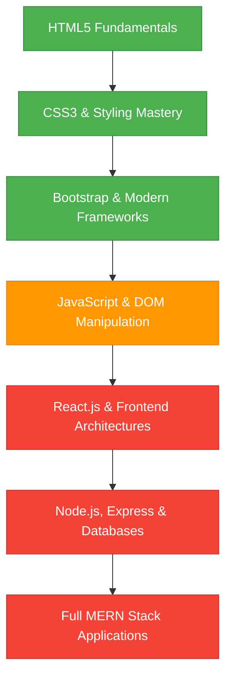

# 🚀 My Full-Stack MERN Journey

Welcome! This repository documents my step-by-step journey to mastering Full-Stack Development (MERN Stack). 

The goal of this repository is to break down complex web development concepts into highly clean, structured, and easy-to-understand codebase. Each directory contains practice files, conceptual notes in comments, clone layouts, and assignments designed to help anyone learn along with me!

---

## 🗺️ Roadmap & Current Progress



---

## 📂 Repository Contents

### 1. 🏗️ HTML5 Fundamentals (`/HTML`)
This folder contains the foundation of structured web layouts. Every tag and attribute is documented with comments explaining how and why it is used.
* **Basic Document Structure**: boilerplate, hello world, heading hierarchy.
* **Text Formatting**: superscript, subscript, HTML entities, semantic structure.
* **Navigation & Media**: anchor tags, images, audio, video.
* **Structural Elements**: differences between `div` & `span`, semantic tags.
* **Forms & User Inputs**: text areas, dropdowns, ranges, check & radio buttons, name attributes.
* **Tables**: rows, columns, headers, spans (`rowspan`, `colspan`).
* **Assignments & Practice**: contains daily practice problems to reinforce concepts.

### 2. 🎨 CSS3 & Styling Mastery (`/CSS`)
Dive deep into advanced styling, positioning rules, layout design, and responsive design patterns.
* **Typography & Fonts**: integration of Google Fonts, text alignment properties.
* **The Box Model**: spacing, border layouts, sizing units (`em`, `rem`, `%`).
* **Positioning & Layouts**:
  * Absolute, relative, fixed, sticky positionings.
  * Z-index stacking contexts.
  * **Flexbox**: flex playground layouts (flex-direction, justify-content, align-items).
  * **CSS Grid**: grid templates, template rows/columns, gaps, properties.
* **Aesthetics & Micro-interactions**:
  * Transitions, transforms, opacity, alpha channels, drop shadows.
  * Animation timelines (`@keyframes`).
  * Interactivity like card hover effects and sidebar menus.
* **Responsive Design**: media queries for multi-device compatibility.
* **Clones & Mini-Projects**:
  * **Quora Clone**: recreating the feed & post card structure.
  * **Pet Adoption Page**: styled content grids.
  * **Custom Sidebar Menu**: fully animated sliding menu.

### 3. ⚡ Bootstrap Integration (`/CSS`)
Practice files exploring rapid UI development using Bootstrap components.
* **Layout**: container classes, grid integrations.
* **Interactive UI Elements**:
  * Badges (success, danger, secondary status icons).
  * Buttons (outline designs, sizes, disabled states).
  * Custom positionings (notification circles, inbox counters).

---

## 🧠 Core Philosophy: Keep it Simple!
Every piece of code here is written keeping **simplicity** in mind. I believe the best way to learn full-stack development is not by memorizing, but by:
1. **Building small components** to isolate and understand single concepts.
2. **Commenting extensively** on what each line of code does.
3. **Cloning real-world elements** (like feeds and sidebar menus) to face practical challenges.

---

## 🛠️ How to Learn Along
1. **Clone the repository**:
   ```bash
   git clone https://github.com/Aarnav007Ac/Full-Stack.git
   ```
2. **Browse the files**: Open any `.html` file inside your browser or view it in your code editor.
3. **Read the comments**: Follow the notes inside the HTML and CSS comments—they explain why specific styling declarations or attributes are selected.
4. **Modify and Break it**: Edit CSS values, add new HTML inputs, and run them locally to see how they behave.

*Stay tuned as I keep adding Javascript, React, and Backend logic files in the upcoming stages!* Happy Coding! 💻🚀
